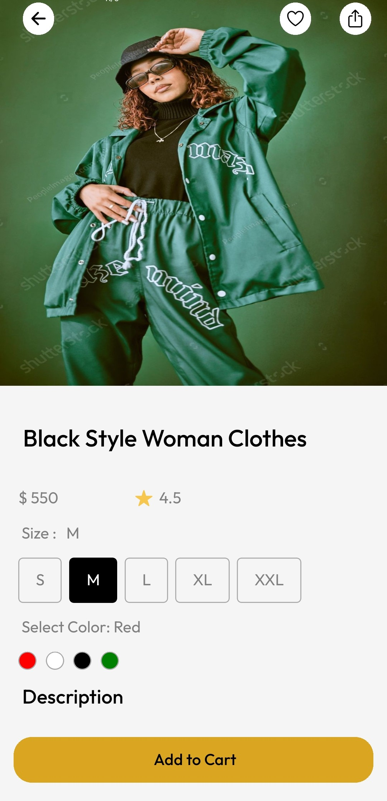

<div align="center">
  <br />
    <h1>Clothes eCommerce Mobile App</h1>
  <br />
  
  <br />
  <div>
    <br/>
    
    
    
    
    
    
  </div>

  <h3 align="center">Day 6 of <b fontweight="bold">30Days-30Apps Challenge</b></h3>
</div>

## 📋 <a name="table">Table of Contents</a>

1. 🤖 [Introduction](#introduction)
2. ⚙️ [Tech Stack](#tech-stack)
3. 🔋 [Features](#features)
4. 🤸 [Quick Start](#quick-start)
6. 🔗 [Assets](#links)

## <a name="introduction">🤖 Introduction</a>

It is a convenient and easy-to-use food delivery application that connects customers with their favorite local clothes for some categories. With a wide variety of size and color to choose from, users can browse clothes, place orders, and track their clothes in real-time. 

## <a name="tech-stack">⚙️ Tech Stack</a>

- React Native
- TypeScript
- Expo
- VS Code
- Hygraph
- Clerk Authentification

## <a name="features">🔋 Features</a>

👉 **Get Started**:  an essential component during onboarding and user engagement <br />
👉 **React Navigation**: used for managing navigation in React Native applications<br />
👉 **Screens**:  play a crucial role in shaping the user experience. <br />
👉 **Authentification**:  We have used Clerk Authentification SaaS to provide Authentification functions to our application <br />
👉 **Database**:  We have used Hygraph to manage Application Database System <br />

## <a name="quick-start">🤸 Quick Start</a>

Follow these steps to set up the project locally on your machine.

**Prerequisites**

Make sure you have the following installed on your machine:

- [Git](https://git-scm.com/)
- [NodeJS](https://nodejs.org/en)
- [npm](https://www.npmjs.com/) (Node Package Manager)

**Cloning the Repository**

```bash
git clone https://github.com/DarkShadowCoder/Food_Delivery_App.git
cd Food_Delivery_App
```

**Installation**

Install the project dependencies using npm:

```bash
npm install
```

**Running the Project**

```bash
npx expo start --android
```

Open ExpoGo in your mobile phone and scan QR code.

## <a name="links">🔗 Assets</a>
<details>
  <summary><code> Interface ScreenShots</code></summary>
  
  
  
  
</details>
This App is based on <a href="https://www.behance.net/isaiselvi">@IsaiselviP</a>'s design


 
